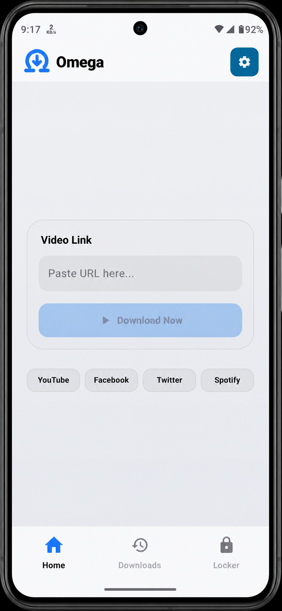
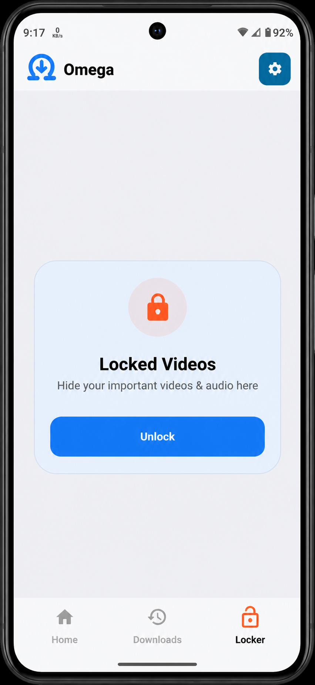
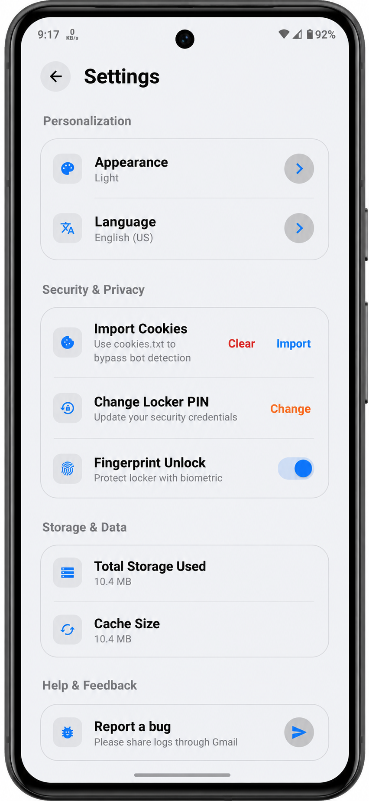
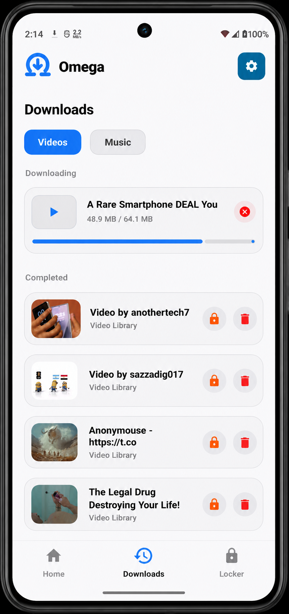

<table align="center">
  <tr>
    <td>
      
    </td><table align="center">
  <tr>
    <td>
      |
    </td>
    <td>
      <h1 style="margin: 0;">Omega Video Downloader</h1>
    </td>
  </tr>
</table>

A fast, privacy-focused social media video and audio downloader for <strong>YouTube</strong>, <strong>Facebook</strong>, and <strong>Instagram</strong>. 
Built with a modern Material Design interface, completely ad-free, with no tracking or data collection.

### Download

<!--
  

  
-->
  <!--

-->

### Key Features

- Universal Platform Support — Download videos from YouTube, Facebook, and Instagram.
- High-Resolution Downloads — Choose from multiple video and audio quality options.
- Private Locker — Securely protect your downloaded videos and audio files.
- Audio Extraction — Download audio-only versions of supported videos.
- Advanced Download Manager — Download multiple files simultaneously with ease.
- Built-in Media Player — Supports gesture controls for brightness, volume, and seeking.
- Modern Glassmorphism UI — Clean, elegant, and intuitive Material Design interface.
- Privacy First — No account required, no advertisements, no tracking, and no data collection.

### Architecture

Most downloaders are DUMB—they just look at a website's text and search for anything ending in .mp4 and they fail.
O-V-D uses (Site-Specific Extractors) which is a much smarter logic:

#### WHAT "O-V-D" DOES:

- **Mimics a Browser**:
Instead of just looking at the page, it acts like a real person using a browser. It can solve the puzzles (signatures) that YouTube uses to block bots.

- **Accesses Hidden APIs:**
It doesn't just scrape the website you see; it talks to the hidden private APIs that the official apps use. This is how it gets high-quality 4K video when others only see 720p.

- **Dynamic Adaptation:**
There are over 1,000 specific scripts inside the app, each dedicated to a different website. If Instagram changes how its site works today, the library is updated with new logic specifically for Instagram's new layout.

- **JS Reverse Engineering:**
Many sites hide their video links behind complex JavaScript code. O-V-D's logic is capable of reading and reverse-engineering that code to find the secret link that simple regex downloaders will never see.

O-V-D uses 3 heavy tools yt-dlp, FFmpeg and Aria2c. All of these increase the size of apk file to over 200MBs. But, it's worth it!

**Note**: Must download cookies.txt file of any brower using Chrome Cookies Extractor Extension and import it in app's settings.
Core Components

### Screenshots

  
  
  
  

**⚠️ Important**

Importing cookies.txt file in app settings makes app effectively bypass bot detection.
This helps prevent video extraction from being blocked by supported websites and significantly improves download reliability. Without imported cookies, some links may fail. 

  <!--
  

  -->

